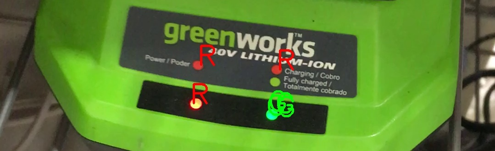

# Is it Red or Green?



Is the battery charged? Is the broadband connection up or down?

If you have [red/green color blindness](https://en.wikipedia.org/wiki/Color_blindness), these questions can sometimes be hard to answer.

This is the repository for a simple mobile web app that analyzes video from your phone's camera and labels regions of bright red or green (or blue) color.
Point the camera at a red or green (or blue) LED and it should be labeled.

Works best with good lighting.
You may need to get a close-up view and/or try different angles before the color is detected.
Minimal effort is made to avoid labeling things that aren't LEDs.

Try it here [https://www.isitredorgreen.com](https://www.isitredorgreen.com)

## Background

General color finding apps are available but I have found them lacking for reading LEDs:
* they only sample color from a small target area and are hard to aim; making this worse, LEDs tend to be overexposed by the camera and must be sampled around the perimeter to get an accurate color reading
* they don't allow you to read multiple LEDs at the same time
* they don't handle blinking LEDs well
* they display colors from a large palette of color names instead of giving a simple red/green answer

What's needed, I thought, is a simple app that does just one thing: point the camera at some LEDs and the app finds and labels them red or green (or blue).
Surely this must be possible with today's computer vision technology.

So, I grabbed [OpenCV](https://opencv.org), spent some quality time with google and stackoverflow, tried several approaches, and settled on a simple algorithm that seems to work pretty well.
I'm publishing the code here, both the python that I developed the algorithm in and an html5 javascript port that runs in mobile web browsers.

## How It Works

The algorithm is simple:
* look for all pixels with a red component that is both bright (200-255) and at least twice as large as the green or blue components
* find contour lines around those pixels, grouping them into regions
* label those regions with a red R
* do the same for green and blue

### Python

In python, using opencv-python v4.5, the algorithm looks like this
```
def labelColor(src, dst, lowerBound, upperBound, text, textColor):
    # create a mask including all pixels within the specified color range
    mask = cv2.inRange(src, lowerBound, upperBound)
    # find contours around clusters of pixels selected in mask
    contours, hierarchy = cv2.findContours(mask, cv2.RETR_EXTERNAL, cv2.CHAIN_APPROX_NONE)
    # label each contour with the specified text
    for c in contours:
        M = cv2.moments(c)
        if M['m00'] != 0:
            # place label at the centroid of the contour
            cx = int(M['m10']/M['m00'])
            cy = int(M['m01']/M['m00'])
            cv2.putText(dst, text, (cx, cy), cv2.FONT_HERSHEY_SIMPLEX, 2, textColor, 4)
            
# colors are BGR
labelColor(frame, dst, (0, 0, 200), (100, 100, 255), 'R', (0, 0, 255));
labelColor(frame, dst, (0, 200, 0), (100, 255, 100), 'G', (0, 255, 0));
labelColor(frame, dst, (200, 0, 0), (255, 100, 100), 'B', (255, 0, 0));
```

A command-line python program runs the algorithm on photos and videos, displaying the labeled output in a window (unless the `-b` option is specified) and also saving it to a file.
```
% ./labelRGB.py -h
Usage: labelRGB.py [options] file

Options:
  -h, --help  show this help message and exit
  -b          non-interactive batch mode
  -w          wait for key press before exit
```

Label photo
```
% ./labelRGB.py charger.jpg
```

Label video
```
% ./labelRGB.py charger.avi
```

### Web Application

An html5 javascript port, using opencv.js v4.5, runs the algorithm in a mobile web browser on live video from the front-facing camera, displaying the labeled output in realtime.

Access to the front-facing camera is through the html5 WebRTC Media interface.

NOTE: The web app must be accessed over https in order for the browser to allow access to the camera.

Try it here [https://www.isitredorgreen.com](https://www.isitredorgreen.com)

## Requirements

If you want to run the python code, you'll need the following

* Python3 (https://www.python.org)
* OpenCV (https://www.opencv.org)

On MacOS:
```
% brew install python3
% pip3 install opencv-python
```
